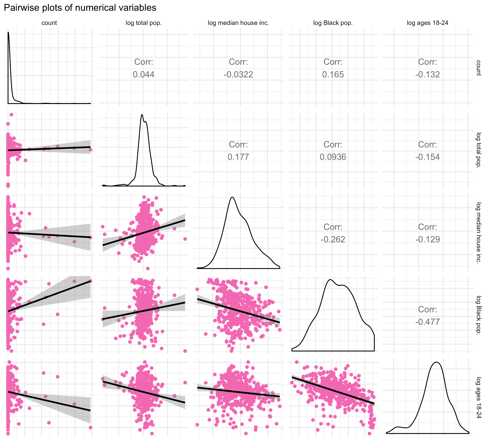
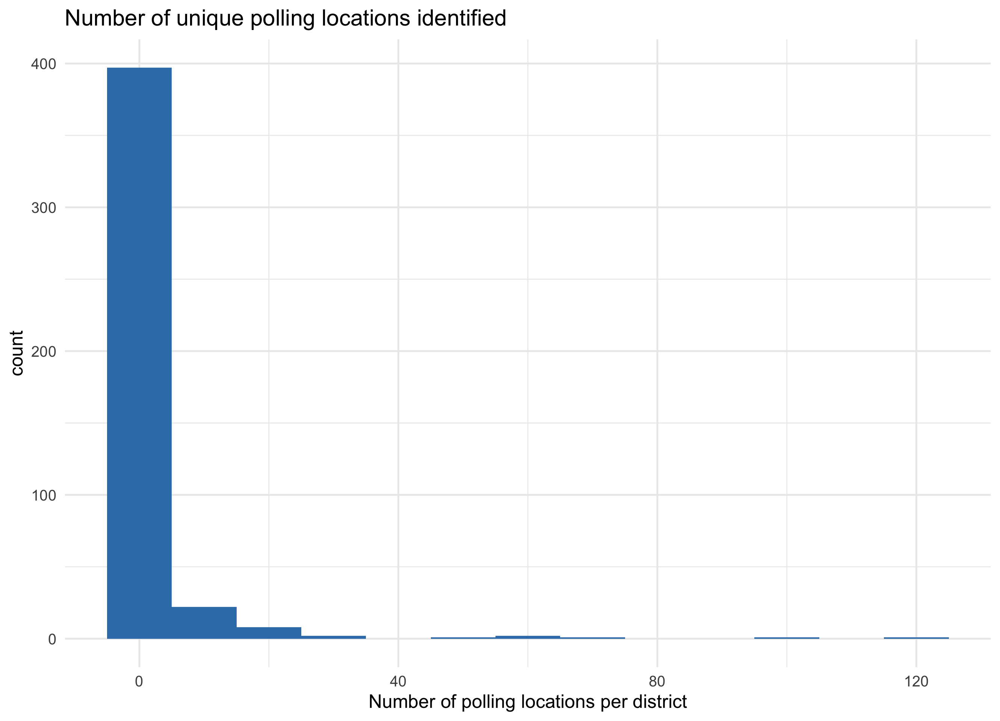

```{r setup, warning = FALSE, message = FALSE, results='hide', echo = FALSE}
rm(list = ls())
x <- c("tidyverse", "magrittr", "RColorBrewer", "rio", "rjson",
       "lubridate", "knitr", "kableExtra", "listviewer",
       "purrrlyr", "GGally", "gridExtra")
lapply(x, library, character.only = TRUE, quietly = TRUE, verbose = FALSE)
rm(x)
knitr::opts_chunk$set(echo = FALSE, message = FALSE, warning = FALSE,
                      fig.align = "center", out.width = "600px")
options(knitr.table.format = "html") 
load("data/clean_pizza.Rdata")
load("data/2018-election-results.Rdata")
load("data/map_data.Rdata")
load("data/acs_cd.Rdata")
load("data/mod_df.Rdata")
load("data/missed_opp.Rdata")
```


# Introduction 🗳️

The inspiration for this project came during the 2018 midterm election when I came across a Twitter account called [`@PizzaToThePolls`](https://twitter.com/PizzaToThePolls). On the election Day, Pizza to the Polls was tweeting about delivering pizzas to polling locations across the United States. 

<blockquote class="twitter-tweet"><p lang="ja" dir="ltr">Pizza 1300 S Grand Ave, Santa Ana, CA 92705, USA?<br>. ∧＿∧ <br> (´･ω･)<br>　 |　⌒Ｙ⌒　/ /<br>　 \ヽ　 ｜　 ﾉ／<br>　　＼ ﾄー🍕ーｲ /<br>　　 ｜ ミ土彡 ｜<br> <br>5 pizzas ABSOLUTELY <br> <br>via <a href="https://t.co/34xXjQiPJc">https://t.co/34xXjQiPJc</a></p>&mdash; Pizza to the Polls (@PizzaToThePolls) <a href="https://twitter.com/PizzaToThePolls/status/1060035393968660480?ref_src=twsrc%5Etfw">November 7, 2018</a></blockquote> <script async src="https://platform.twitter.com/widgets.js" charset="utf-8"></script>

The goal of this project is to collect the polling locations where Pizza to the Polls delivered pizzas on the 2018 Midterm Election and learn about the profile of voters who reached out to Pizza to the Polls. The rest of the analysis proceeds as follows:

1. explain data collection method;
2. create an interactive map of the polling addresses;
3. conduct exploratory analysis (bag-of-words and regression);
4. present recommenations for how Pizza to the Polls can improve its outreach for the upcoming election;
5. share what I learned from this project. 

**NB**a 

## About Pizza To the Polls 


[Pizza to the Polls](https://polls.pizza/about/) (abbreviated PttP🍕) is a 501(c)(4) nonprofit organization that receives reports about long polling lines on various social media platforms and requests pizza deliveries to polling locations.[^more] Although PttP🍕 is not officially affiliated with any political party in the United States, there is an obvious partisan flavor to their Twitter activity. The account primarily follows progressive advocacy groups, liberal media figures, and Democratic politicians. To be clear, unlike 501(c)(3) organizations, 501(c)(4) organizations are allowed to engage in lobbying activity so long as the purpose is to promote their social welfare objectives. Additionally, they do not lose their tax-exemption status from engaging in electoral campaign activities (i.e. activities influencing electoral results or advocating for a candidate) so long as those activities remain secondary to their primary missions.[^secondary] 

[^more]:[This article](https://zapier.com/blog/pizza-to-the-polls-automation/?utm_medium=social&utm_source=twitter) from *zapier* explains how the organization delivers pizzas. 

[^secondary]: From the IRS website, https://www.irs.gov/charities-non-profits/other-non-profits/social-welfare-organizations. 


## Collecting tweets 

I used Twitter API to [search for tweets](https://developer.twitter.com/en/docs/tweets/search/overview) posted by PttP🍕 on 2018 Midterm Election Day and [look up information on accounts](https://developer.twitter.com/en/docs/accounts-and-users/follow-search-get-users/overview) followed by PttP🍕 ("friends"). Because there is a technical limitation to collecting direct data on individual Twitter users who were reporting long lines to PttP🍕, the alternative solution is to infer their profile based on the profile of verified Twitter accounts followed by PttP🍕. The assumption is that the population of users who identify with the political vision projected by friends of PttP🍕 is the same population that was reporting long lines on the election day. 


### Searching for tweets 


```{r}
load("data/counts.Rdata")
```

First I made a query asking how many tweets were posted per hour by PttP🍕 from 00:00 of November 6th, 2018 to 02:00 of November 7th, 2018.[^timezone] Inspecting the count query response, I saw that there were few pizza deliveries made before 11:00 of November 6th, and since most polls were closed by midnight, I decided to restrict the timeframe from 11:00 and 23:59 of November 6th, 2018. In total, I retrieved `r sum(raw_counts$count) %>% format(big.mark = ",", scientific = FALSE)` raw tweets. The figure below shows the hourly distribution. 


[^timezone]: From looking at the API query response, it seems that PttP🍕 does not have geolocation enabled on its Twitter account, so it is not possible to tell the time zone. Even if I assume that the account activity is generated in Pacific Standard Time, the timeframe that I selected adequately covers the last polling location that was open before the polls officially closed. 

```{r ggplot_raw_counts}
knitr::include_graphics("./fig/tweets_per_hour.png")
```


Next, I processed the texts to remove any special characters, url's, and @'s, and parsed the cleaned text to detect whether it contained any street address. This reduced the number of relevant tweets to `r sum(parsed_counts$count) %>% format(big.mark = ",", scientific = FALSE)`, which is 5% of the original sample of tweets. The figure below shows the hourly distribution of tweets containing street addresses. 


```{r ggplot_parsed_counts}
knitr::include_graphics("fig/parsed_tweets_per_hour.png")
```


### Looking up friends 

As of January 22nd, 2020, @PizzaToThePolls is [following](https://twitter.com/PizzaToThePolls/following) 399 accounts on Twitter. For each account, I collected their account name, location (if available), URL (if available), profile description, whether the account is verified, the number of followers, and the date the account was created. I display the 203 verified accounts below. The order that the accounts are listed reflect the order in which PttP🍕 followed the accounts.[^order] Only a couple of accounts in the list belong to incumbent or former federal office holders, namely Hillary Clinton, Barack Obama, Mitt Romney, Paul Ryan, and Marco Rubio.

[^order]: There is no data on when Pizza to the Polls started following an account.


```{r}
friends_ver <- import("./data/csv/friends_of_PTTP.csv", header = TRUE) %>%   
        dplyr::select(-V1) %>% 
        filter(verified == TRUE) %>%
        mutate(id = as.character(id)) %>%
        dplyr::select(-id, -verified, name, everything())
lst <- setNames(by_row(friends_ver, ~ unlist(.x), .collate = "list")$.out, 
                friends_ver$name)
reactjson(lst, collapsed = 1)
```

There is no query method that returns a history of a user's follow-unfollow activity, so I cannot verify whether @PizzaToThePolls were following the same accounts during the 2018 Midterm Election. Campaign accounts are often deactivated after the election, so it is very likely that the current list of friends do not include accounts of electoral candidates who lost the midterm.


## Geocoding addresses

I used Google's [Geocoding API](https://developers.google.com/maps/documentation/geocoding/start) to parse the addresses and locate the geocoordinates of the addresses. From the API response, I scraped the street number, route, state, county, zipcode, longitude, and latitutde. The following list shows the first 10 entries of the dataset.

```{r, echo = FALSE}
load("data/clean_pizza.Rdata")
```


```{r all_locs, echo = FALSE, warning = FALSE}
head <- all_locs %>% 
    dplyr::select(id, clean_text, lat, lng, 
                  st_num, route, city, county, zipcode, state_abbv) %>% head() 
lst <- setNames(by_row(head, ~ unlist(.x), .collate = "list")$.out, 
                head$id)
reactjson(lst, collapsed = 1)
```


```{r}
unique_states <- all_locs %>% group_by(state_abbv) %>% summarize(count = n())
unique_cities <- all_locs %>% group_by(city, state_abbv) %>% summarize(count = n())
```


According to my sample, on 2018 Election day PttP🍕 delivered pizzas to `r nrow(unique_locs)` unique addresses across `r nrow(unique_states)` different states and `r nrow(unique_cities)` different cities.[^numbers] 

[^numbers]: On their website, PttP🍕 [says](https://polls.pizza/about/) that in 2018 they delivered pizzas to "611 polling places across 41 states." The discrepancy between my numbers and theirs may be due to their counting pizzas delivered throughout the year, including those made during special elections that happened earlier in the year. 


## 2018 Midterm Election data

I scraped 2018 Midterm congressional and gubernatorial election results from their Wikipedia pages. For all House, Senate, and gubernatorial races, I scraped the winning candidate's and the second runner's names (`candidate1` and `candidate2`), parties (`party1` and `party2`), and final voteshares in percentages (`share1` and `share2`). 

I also consulted the Cook Political Report's most recent ratings prior to November 6th, 2018 to label whether the race was considered a key for the Democratic Party's takeover of the legislative branch (`key`).[^CPR] If a race was ranked as leaning to either party or a toss-up, I labeled the race as a key race.[^outlets] Lists of key House, Senate, and governors seats are presented below. 

```{r}
cat("Key House races: \n", house_key, "\n")
cat("Key Senate races: \n", senate_key, "\n")
cat("Key governor races: \n", governor_key, "\n")
```

Because 2018 was noted for the number of female candidates on the ballot, I also record the number of women candidates who proceeded to the general election for each race.

```{r summary_table}

load("data/2018-election-results.Rdata")

house_sum <- xtabs(~ key + women, data = house_races)
senate_sum <- xtabs(~ key + women, data = senate_races)
governor_sum <- xtabs(~ key + women, data = governor_races)
house_sum %>% kable(format = "html", caption = "House races, unit = districts")
senate_sum %>% kable(format = "html", caption = "Senate races, unit = states")
governor_sum %>% kable(format = "html", caption = "Governor races, unit = states")
```


[^CPR]: "2018 House Race Ratings," *The Cook Political Report*, October 30, 2018, [link](https://cookpolitical.com/ratings/house-race-ratings/187550); "2018 Governor Race Ratings, *The Cook Political Report*, October 26, 2018, [link](https://cookpolitical.com/ratings/governor-race-ratings/187543); "2018 Senate Race Ratings," *The Cook Political Report*, October 26, 2018, [link](https://cookpolitical.com/ratings/senate-race-ratings/187540).


[^outlets]: I compiled a list of key House, Senate, and gubernatorial races mentioned by various media outlets and were rated as either toss-up, leaning Republican, or leaning Democratic by the Cook Political Report. "The Washington Post's Senate Race Ratings," *Washington Post*, November 2nd, 2018, [link](https://www.washingtonpost.com/graphics/2018/politics/senate-ratings/); "The Top 10 House Races of 2018," *Washington Post*, March 18, 2018, [link](https://www.washingtonpost.com/news/the-fix/wp/2018/03/18/the-top-10-house-races-of-2018/); "The top races for control of governors' mansions," *Vox*, November 19, 2018, [link](https://www.vox.com/a/midterms-2018/top-governor-races); "The battlefield to control the House of Representatives is huge," *Vox*, Novebmer 19, 2018, [link](https://www.vox.com/a/midterms-2018/top-house-races); "The most contested Senate races," *Vox*, November 19, 2018, [link](https://www.vox.com/a/midterms-2018/top-senate-races).

[^women]: "2018 Summary of Women Candidates," Center for American Women and Politics, November 14, 2018, [link](https://cawp.rutgers.edu/potential-candidate-summary-2018).


# Interactive map exported as Shiny app

I created [an interactive map](https://asakomikami.shinyapps.io/pizza_to_the_polls/) with `tmap` package (v2.3.1) in R and published it as a RShiny app. There are markers placed on polling locations where pizzas were delivered; the number on the markers counts the number of deliveries made to that location. The map has three layers. The layers color the districts or states that held key races for House, Senate, and governor seats. 

<a href="https://asakomikami.shinyapps.io/pizza_to_the_polls/"></a>

# Analysis

One goal of this project is to learn how PttP🍕---as a nonprofit organization working towards increasing voter turnout by motivating voters to stay in line with pizzas---can improve its outreach. Therefore, I want to learn the profile of voters who were most likely to know and reach out for pizzas on Election day. I also want to know which districts or states had close races but did not have voters contacting PttP🍕; these are places where higher turnout could have shifted the result and therefore constitute missed opportunities for PttP🍕.


## Bag of Words

Since PttP🍕 relies on social media platforms such as Twitter to collect reports of long polling lines, young people in general are more likely to know about PttP🍕 out of all eligible voters. Accounts of media figures and activists that are connected with PttP🍕 on these platforms would also serve as a mouthpiece for the organization. By social network theory, I assume that their followers would be the most likely to know about Pizza to the Polls. 

I created a corpus of profile descriptions of PttP🍕's friends and performed Bag of Words on it using `sklearn.feature_extraction.text.CountVectorizer`. The top 25 most frequent terms along with its frequencies are shown below.[^top50] The frequencies of media terminology shows that the most common types of accounts are those of journalists, editors, late night show hosts, and political pundits.

[^top50]: I am excluding English stop words (e.g. "and") and custom stop words that appear very frequently in Twitter profiles ('twitter', 'email', 'https', 'com', 'politics', 'gmail', 'account', 'tweets', 'views', 'american', 'state', 'opinions'). 

```{r}
file <- file("data/friends/top_50terms.txt", open = "r")
top50 <- readLines(file)
for (i in 1:25){
        print(top50[i])
}
close(file)

```


```{r}
keywords <- c("representative", "senator", "governor", "candidate", 
        "campaign", "movement", "our")
create_regex <- function(string){
        reg <- string %>% map(~ str_c("(?:^|\\W*)", .x, "(?:$|\\W*)")) 
        return(reduce(reg, ~paste(.x, .y, sep = "|")))
}
keywords_reg <- create_regex(keywords)
friends_key <- import("data/csv/friends_of_PttP.csv", header = TRUE) %>%
        mutate(id = as.character(id)) %>%
        filter(str_detect(tolower(description), keywords_reg))  
```

Below I have filtered accounts of former or current federal office holders, campaign managers, and advocacy groups by flagging profile descriptions that mention one of the following words: "representative", "senator", "governor", "candidate", "campaign", "movement", "our."[^our] Note that these words are neutral: they neither explicitly nor implicitly imply any allegiance to a specific policy position. Therefore, the Twitter accounts that pass through this filter should only reflect PttP🍕's political allegiance. The result is `r dim(friends_key)[1]` accounts shown below. 

[^our]: The 1st person plural possessive, "our," is a commonly used word in profile description of advocacy groups regardless of their political issue and ideology.

```{r}
library(listviewer)
lst <- setNames(by_row(friends_key, ~ unlist(.x), .collate = "list")$.out, 
                friends_key$name)
reactjson(lst, collapsed = 1)
```

What stands out is that the list includes March For Our Lives and their founders (Jacyln Corin, Cam Kasky, and David Hogg). Gun control and women's reproductive rights are the two most divisive issues in U.S. politics. The fact that anti-gun control and anti-abortion advocacy groups do not appear in the result provides strong evidence that PttP🍕 is aligned with politically liberal and progressive agenda. By social network theory, I argue that the same can be said for voters who contacted PttP🍕 on the Election day. 


## Regression models

If there is a selection mechanism behind the kind of voters who would contact PttP🍕, it should be reflected in the polling locations where pizzas were delivered on the Election day. The unit of analysis is U.S. 115th congressional districts. The outcome variable of interest is the number of unique polling locations that received pizza deliveries from PttP🍕. The predictors are 

- whether the district was holding one of the key House, Senate, or gubernatorial races: `key_rep`, `key_sen`, `key_gov`; 
- whether the first and second candidates for House, Senate, or gubernatorial races were women: `women_rep`, `women_sen`, `women_gov`; 
- and district-level socioeconomic variables retrieved from US Cesus, logged: `medianHouseInc_log`, `blackPop_log`, `totalPop_log`, `age18to24_log`. 

There are four congressional districts that had special elections prior to November, namely `r us_cd$label[is.na(us_cd$key)]`. Twenty-three states did not have a senate election, and twenty states did not have a gubernatorial election. Districts that fall into any of these cases are given "No election" label for that election. 

### Pairwise plots

The first panel shows pairwise plots for numerical variables, namely the outcome variable *count*, logged total population (*log total pop*), logged median house income (*log median house inc.*), logged Black population share (*log Black pop.*), logged population share of age group 18 to 24 (*log age 18-24*). None of the pairs of predictor variables have strong correlation to worry about multicollinearity. *log Black pop.* and *log ages 18-24* are positively and negatively correlated with *count* respectively, but thes smoothed conditional mean lines are pulled by extreme *count* values. 


```{r}
load("data/mod_df.Rdata")
```

```{r ggpair_num}

```


The second panel shows pariwise plots with categorical predictors. Because the overwheling number of zeros make the plots undecipherable, I filtered out zero counts. The first row shows box plots of logged count against whether the district was holding a key House, Senate, or gubernatorial election. What is interesting is that the trend for Senate and governor races is opposite of that of House races. Key Senate and governor races have higher counts with smaller variance whereas the key House races have lower count values. Likewise, when there are more women on the ballot, Senate and governor races tend to have higher count values, but the trend is reversed for House raes. 


```{r ggpairs_cat}

```


The histogram below shows that a vast majority of congressional districts (approximately 80 percent) did not have pizza deliveries from PttP🍕 at one of their polling locations. This suggests that reporting a long line to PttP🍕 on the Election day was itself a rare event. Since our count data has excess zeroes, the best fitting model would incorporate the assumption that the data generating process behind the count values to be different from that behind the zeroes. 


```{r hist_cd, results="asis"}

```


### Negative binomial regression

I want to run a regression to model how the predictor variables are associated with the count values. While negative binomial and poisson regressions are often used to model count data, negative binomial is better suited when there's over-dispersion, i.e. the variance of the outcome variable is greater than the mean. I will run both and then choose the better fit based on the diagnosis.

Additionally, 

- I am specifying the dispersion parameter by supplying its estimate, $\hat{\sigma}^2 = \dfrac{D(y, \mu)}{n-p}$ where the nominator, $D( y, \mu)$, is the deviance and the denominator, $n-p$, is the degrees of freedom. 
- I am also specifying `totalPop_log` (logged total population) as an offset because the number of possible pizza deliveries is upper-bounded by the number of polling locations in the district, which I assume is proportional to the population size. 


```{r mod_base}
library(MASS)
mod_base <- glm.nb(count ~ key_rep + key_sen + key_gov + 
               women_rep + women_sen + women_gov +  
               medianHouseInc_log +  
               blackPopShare_log + age18to24Share_log + offset(totalPop_log),
           data = mod_df) 
sigma2 <- deviance(mod_base)/df.residual(mod_base)
mod_pois <- glm(count ~ key_rep + key_sen + key_gov + 
               women_rep + women_sen + women_gov +  
               medianHouseInc_log +  
               blackPopShare_log + age18to24Share_log, 
               offset = totalPop_log,
           data = mod_df, family = poisson)
```


Below I plot the residuals against the predicted mean value. The smaller range of the y-axis scale on the negative binomial plot tells me that the negative binomial has a better fit than the Poisson model. 

```{r}
color <- brewer.pal(3, "Set1")
df <- cbind("base_fitted" = fitted.values(mod_base), 
            "base_resid" = residuals(mod_base),
            "pois_fitted" = fitted.values(mod_pois), 
            "pois_resid" = residuals(mod_pois)) %>%
    as.data.frame()
base <- ggplot(data = df, aes(x = base_fitted, y = base_resid)) +
    geom_point(color = color[2]) + theme_minimal() + 
    ggtitle("Negative binomial") + xlab("") + ylab("")
pois <- ggplot(data = df, aes(x = pois_fitted, y = pois_resid)) +
    geom_point(color = color[1]) + theme_minimal() +
    ggtitle("Poisson")+ xlab("") + ylab("")
grid.arrange(base, pois, nrow = 1, left = "residuals", bottom = "predicted mean values")
```


The result of the negative binomial model fit confirms most of what we gauged from the preliminary analysis. 

- Districts with women candidates in the race were more likely to have had pizza deliveries. 
- Key Senate and governor races, but not House races, are more likely to have reached out to Pizza to the Polls.
- Districts with higher share of Blacks and ages 18 to 24 are associated with more pizza delivery counts. 

```{r}
summary(mod_base, dispersion = sigma2)
```


## Propensity score outliers 

So far, I have been modeling the count values. However, I am also interested in is whether these predictors made any difference to whether *any* pizza deliveries were made to a district. I imagine that once someone reports a long polling line to Pizza to the Polls, then more pizzas are requested simply by word of the mouth. Therefore, the more interesting outcome to model is the zeros vs. non-zeros. I create another outcome variable, `zero` for each district $i$ where 
    $$ \texttt{zero}_i = \begin{cases} \texttt{TRUE} & \; \text{if }\texttt{count}_i = 0 \\
                                        \texttt{FALSE} & \; \text{if }\texttt{count}_i > 0 \end{cases}.$$ 
I will use a logistic regression to model this new outcome variable against election-related predictors, namely `key_rep`, `key_sen`, `key_gov`, `women_rep`, `women_sen`, and `women_gov`.


```{r}
load(file = "data/missed_opp.Rdata")
```

I am also interested in identifying missed opportunities, i.e. districts where no pizza deliveries were requested even though districts with similar demographics and elections did. These are the districts where more voter turnout could have influenced the result and where the existence of a nonprofit like Pizza to the Polls should be promoted. Therefore, I am going to plot the distribution of propensity score for observations with `zero == TRUE` and do likewise for observations with `zero == FALSE` with similar propensity score. 

```{r}
knitr::include_graphics(path = "fig/pscore_hist.png")
```

Propensity score is the probability of having `zero == TRUE`. Naturally, the mass of the histogram below the 0 line is shifted towards the left. However, there are also a few districts in the histogram above the 0 line that relatively low propensity scores. I define missed opportunities as districts with `zero == TRUE` that have propensity score below 0.65, which are displayed below. To make the values of numeric variables more comprehensible, I have binned these variables into deciles (`medianHouseInc_q`, `totalPop_q`, `blackPopShare_q`, `age18to24_q`). 

```{r}
missed_opp %>% rmarkdown::paged_table()
```

None of the district detectedace, continuing the trend we've seen in the main result. However, these districts usually had woman candidate running from the Democratic party including LA-03, LA-06, NC-07, and NC-12, where the GOP incumbents won at comfortable margin. The fact that these districts appear in the table suggests to me that these are districts that were overlooked but nonetheless would have welcomed the help of nonprofits like Pizza to the Polls. 

# Lessons for the 2020 election

If I were working at Pizza to the Polls and was tasked with improving the organization's outreach for the upcoming 2020 election, I would make two recommendations to their operation. First is to **pay attention to key Senate and gubernatorial elections**. Although the probability that the Democrats would take the Senate was low, voters waiting to vote for the key Senate elections were more likely to know and contact Pizza to the Polls than those voting in key House districts. On the other hand, Democrats were vying to win key governorships such as Floria. Georgia where Stacey Abrams was running for governor was also the state that had much controversy over deliberate voter suppression before the election. It is unsurprising that the largest number of pizza deliveries to a single polling location was observed in Georgia. Since senators and governors are elected by the whole state, reaching out to candidates running for these offices is a more efficient way of spreading information about Pizza to the Polls.

My second recommendation is to **reach out to women candidates**. All the districts named as missed opportunities were districts where a woman was running for the House, Senate, or governor. [Past studies](https://fivethirtyeight.com/features/democrats-primaries-candidates-demographics/) have shown that women are less likely than men to run for office. Even though 2018 saw a remarkable number of women challengers on the ballot across the country, they were still more likely than their male counterpart to have had experience as elected officials. Women tend to set higher bars on themselves when making a career choice in politics, and they still face [explicit and implicit sexism](https://fivethirtyeight.com/audio-features/when-women-run/) while on the campaign trail and in office. Thus, although many of the missed opportunities were not one of the key races of 2018 Midterm, supporting women breaking into higher offices would naturally align with PttP🍕's democratic agenda as evidenced by my bag-of-words analysis. I would recommend Pizza to the Polls to actively engage with campaigns of women candidates and spread awarenss of the organization. 


# Personal commentary

This is a full-stacked project where I collected the data myself (with my own money) and conducted much analysis as I can to get the most out of the data. 

Majority of my time was spent on **cleaning and augmenting the data** by scraping election results from Wikipedia and external sources and merging them together. Even while doing the final analysis, I have had to go back to my code to fix incorrect entries, which attests to how [important](https://hackernoon.com/the-ai-hierarchy-of-needs-18f111fcc007) this [underrated](https://twitter.com/vboykis/status/1054408259149299712?s=20) process is. 

This project made a heavy use of API's: Twitter API, Google's Geocoding API, and US Census API. I tried three ways of **storing credentials**: saving keys in credential files, saving keys in the system environment, and [saving keys in a .env file](http://jonathansoma.com/lede/foundations-2019/classes/apis/keeping-api-keys-secret/). I ended up sticking to the third method for two reasons. First, `dotenv` package is available both for Python and R. Second, since I had to regenerate the API keys more than once during this project, I liked having a file that I could easily edit instead of opening the system environment through the terminal. Additionally, I finally learned the utility of .gitignore. 

Finally, this project has motivated me to learn more about **data visualization**. There are many `ggplot2`-related packages out there like `ggfacet` that I haven't taken advantage of. Even for the simple plots, there are simple modifications that I wanted to do such as using colored text in titles [instead of legends](https://twitter.com/djnavarro/status/1222952500237520897?s=20).
