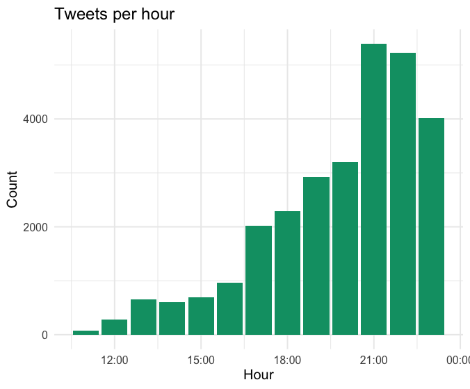
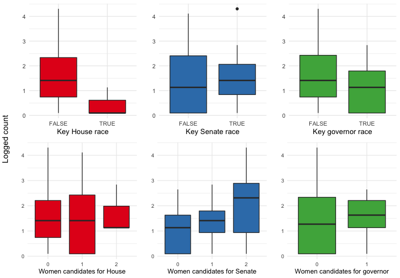

```{r setup, warning = FALSE, message = FALSE, results='hide', echo = FALSE}
rm(list = ls())
x <- c("tidyverse", "magrittr", "RColorBrewer", "rio", "tmap", "rjson",
       "lubridate", "knitr", "kableExtra", "tmaptools", "listviewer", "purrrlyr",
       "stargazer", "GGally", "gridExtra")
lapply(x, library, character.only = TRUE, quietly = TRUE, verbose = FALSE)
rm(x)
knitr::opts_chunk$set(echo = FALSE, message = FALSE, warning = FALSE,
                      fig.align = "center")
load("data/clean_pizza.Rdata")
load("data/2018-election-results.Rdata")
load("data/map_data.Rdata")
load("data/acs_cd.Rdata")
load("data/mod_df.Rdata")
```


# Introduction

The inspiration for this project came during the 2018 midterm election when I came across a Twitter account called [`@PizzaToThePolls`](https://twitter.com/PizzaToThePolls). On the election Day, Pizza to the Polls was tweeting about delivering pizzas to polling locations across the United States ([sample tweet](https://twitter.com/PizzaToThePolls/status/106003539396866048) below). 

<blockquote class="twitter-tweet"><p lang="ja" dir="ltr">Pizza 1300 S Grand Ave, Santa Ana, CA 92705, USA?<br>. ∧＿∧ <br> (´･ω･)<br>　 |　⌒Ｙ⌒　/ /<br>　 \ヽ　 ｜　 ﾉ／<br>　　＼ ﾄー🍕ーｲ /<br>　　 ｜ ミ土彡 ｜<br> <br>5 pizzas ABSOLUTELY <br> <br>via <a href="https://t.co/34xXjQiPJc">https://t.co/34xXjQiPJc</a></p>&mdash; Pizza to the Polls (@PizzaToThePolls) <a href="https://twitter.com/PizzaToThePolls/status/1060035393968660480?ref_src=twsrc%5Etfw">November 7, 2018</a></blockquote> <script async src="https://platform.twitter.com/widgets.js" charset="utf-8"></script>

The goal of this project is to collect the polling locations where Pizza to the Polls delivered pizzas on the 2018 Midterm Election and learn about the profile of voters who reached out to Pizza to the Polls. The rest of the analysis proceeds as follows:

1. explain data collection method;
2. create an interactive map of the polling addresses that were collected;
3. conduct descriptive analysis (bag-of-words and Poisson count model);
4. present recommenations for how
Pizza to the Polls can improve its outreach for the upcoming election;
5. summarize what I learned from this project. 


# Data 

## About Pizza To the Polls

[Pizza to the Polls](https://polls.pizza/about/) (abbreviated PttP) is a 501(c)(4) nonprofit organization that receives reports about long polling lines on various social media platforms and puts in a request to deliver pizzas to those polling locations.[^more_on_TPT]

[^more_on_TPT]:[This article](https://zapier.com/blog/pizza-to-the-polls-automation/?utm_medium=social&utm_source=twitter) from *zapier* explains how the organization delivers pizzas. 

Although PttP is not officially affiliated with any political party in the United States, there is an obvious partisan flavor to their Twitter activity. The account primarily follows progressive advocacy groups, liberal media figures, and Democratic politicians. To be clear, unlike 501(c)(3) organizations, 501(c)(4) organizations are allowed to engage in lobbying activity so long as the purpose is to promote their social welfare objectives. Additionally, they do not lose their tax-exemption status from engaging in electoral campaign activities (i.e. activities influencing electoral results or advocating for a candidate) so long as those activities remain secondary to their primary missions.[^secondary] 

[^secondary]: From the IRS website, https://www.irs.gov/charities-non-profits/other-non-profits/social-welfare-organizations. 


## Collecting tweets and users via Twitter API 

I used Twitter API to [search for tweets](https://developer.twitter.com/en/docs/tweets/search/overview) posted by PttP on 2018 Midterm Election Day and [look up information on accounts](https://developer.twitter.com/en/docs/accounts-and-users/follow-search-get-users/overview) followed by PttP ("friends"). Because there is technical limitation to collecting direct data on Twitter users who were reporting long lines to PttP, the alternative solution is to infer their profile based on the kind of Twitter accounts that PttP follows. The assumption is that the population of users who identify with the political vision projected by friends of PttP is the same population that was reporting long lines on the election day. 


### Searching for tweets 

```{r}
load("data/counts.Rdata")
```

For tweets, first I made a count query asking how many tweets were posted per hour by PttP from 00:00 of November 6th, 2018 to 02:00 of November 7th, 2018.[^timezone] Inspecting the query response, I saw that there were few pizza deliveries made before 11:00 of November 6th, and since most polls were closed by midnight, I decided to restrict the timeframe from 11:00 and 23:59 of November 6th, 2018. In total, I retrieved `r sum(raw_counts$count) %>% format(big.mark = ",", scientific = FALSE)` raw tweets. The figure below shows the hourly distribution. 


[^timezone]: From looking at the API query response, it seems that PttP does not have geolocation enabled on its Twitter account, so it is not possible to tell the time zone. Even if I assume that the account activity is generated in Pacific Standard Time, the timeframe that I selected adequately covers the last polling location that was open before the polls officially closed. 

```{r ggplot_raw_counts}

```


Next, I processed the texts to remove any special characters, url's, and @'s, and parsed the cleaned text to detect whether it contained any street address. This reduced the number of relevant tweets to `r sum(parsed_counts$count) %>% format(big.mark = ",", scientific = FALSE)`, which is 5% of the original sample of tweets. The figure below shows the hourly distribution of tweets containing street addresses. 


```{r ggplot_parsed_counts}

```


### Looking up friends 

As of `r format(Sys.time(), "%B %e, %Y")`, @PizzaToThePolls is [following](https://twitter.com/PizzaToThePolls/following) 399 accounts on Twitter. For each account, I collected their account name, location (if provided), URL (if provided), profile description, whether the account is verified, the number of followers, and the date the account was created. I display the 203 verified accounts below. The order that the accounts are listed reflect the order in which PttP followed the accounts. Only a couple of accounts in the list belong to incumbent or former federal office holders, namely Hillary Clinton, Barack Obama, Mitt Romney, Paul Ryan, and Marco Rubio.


```{r}
friends_ver <- import("data/csv/friends_of_PTTP.csv", header = TRUE) %>% 
        dplyr::select(-V1) %>% 
        filter(verified == TRUE) %>%
        mutate(id = as.character(id)) %>%
        dplyr::select(name, everything())
lst <- setNames(by_row(friends_ver, ~ unlist(.x), .collate = "list")$.out,
                friends_ver$name)
jsonedit(lst, mode = "view")

```

There is no query method that returns a history of a user's follow-unfollow activity, so I cannot verify whether @PizzaToThePolls were following the same accounts during the 2018 Midterm Election. Campaign accounts are often deactivated after the election, so it is very likely that the current list of friends do not include accounts of electoral candidates who lost the midterm. Although the list below does not necessarily reflect the freinds of @PizzaToThePolls two years ago, the public, verified accounts in this list (journalists, pundits, activists, elected officials) can still provide some idea of the kind of voters that would know about the organization. 


## Geocoding addresses with Google's Geocoding API

I used Google's [Geocoding API](https://developers.google.com/maps/documentation/geocoding/start) to parse the addresses and find the geocoordinates of the addresses. From the API response, I scraped the street number, route, state, county, zipcode, longitude, and latitutde. Table \@ref(tab:all_locs) shows the first few rows of the data set.

```{r, echo = FALSE}
load("data/clean_pizza.Rdata")
```


```{r all_locs, echo = FALSE, warning = FALSE}
head <- all_locs %>% 
    dplyr::select(id, clean_text, lat, lng, 
                  st_num, route, city, county, zipcode, state_abbv) %>% head() 
head %>% knitr::kable(format = "html",
               caption = "Geocoded components of polling addresses and cleaned Tweet text"
               ) %>% 
        kable_styling() %>% 
        scroll_box(width = "100%", height = "500px")
```


```{r}
unique_states <- all_locs %>% group_by(state_abbv) %>% summarize(count = n())
unique_cities <- all_locs %>% group_by(city, state_abbv) %>% summarize(count = n())

```


 According to the sampled data, PttP delivered pizzas to `r nrow(unique_locs)` unique addresses, which covers `r nrow(unique_states)` different states and `r nrow(unique_cities)` different cities.[^numbers] 

[^numbers]: On their website, PttP [says](https://polls.pizza/about/) that in 2018 they delivered pizzas to "611 polling places across 41 states." The discrepancy between my numbers and theirs may be due to their counting pizzas delivered throughout the year, including those made during special elections that happened earlier in the year. 


## 2018 Midterm election data

I scraped 2018 Midterm congressional and gubernatorial election results from their Wikipedia pages. For all House, Senate, and gubernatorial races, I scraped the winning candidate's and the second runner's names (`candidate1` and `candidate2`), parties (`party1` and `party2`), and final voteshares in percentages (`share1` and `share2`). 

I also consulted the Cook Political Report's most recent ratings prior to November 6th, 2018 to label whether the race was considered a key for the Democratic Party's takeover of the legislative branch (`key`).[^CPR] If a race was ranked as leaning to either party or a toss-up, I labeled the race as a key race.[^outlets] Lists of key House, Senate, and governors seats are presented below. 

```{r}
cat("Key House races: \n", house_key, "\n")
cat("Key Senate races: \n", senate_key, "\n")
cat("Key governor races: \n", governor_key, "\n")
```

Because this election was noted for the number of female candidates on the ballot, I also record whether the top two leading candidates were women (0 if none, 1 if either, and 2 if both).[^women] The following table counts the number of districts that held key races and the number of women nominees from the major parties running for House, Senate, and gubernatorial seats. 

```{r summary_table}
load("data/2018-election-results.Rdata")
house_sum <- house_races %>% group_by(key, women) %>%
        summarize(n = n())
senate_sum <- senate_races %>% group_by(key, women) %>%
        summarize(n=n())
governor_sum <- governor_races %>% group_by(key, women) %>%
        summarize(n=n())
rbind(house_sum, senate_sum, governor_sum) %>% 
        kable(format = "html", 
              caption = "Summary of districts holding key races and their number of women candidates") %>%
        kable_styling("striped", full_width = FALSE) %>%
        pack_rows("House races", 1,6) %>%
        pack_rows("Senate races", 7, 12) %>%
        pack_rows("Governor races", 13, 16)
       
```


[^CPR]: "2018 House Race Ratings," *The Cook Political Report*, October 30, 2018, [link](https://cookpolitical.com/ratings/house-race-ratings/187550); "2018 Governor Race Ratings, *The Cook Political Report*, October 26, 2018, [link](https://cookpolitical.com/ratings/governor-race-ratings/187543); "2018 Senate Race Ratings," *The Cook Political Report*, October 26, 2018, [link](https://cookpolitical.com/ratings/senate-race-ratings/187540).


[^outlets]: I compiled a list of key House, Senate, and gubernatorial races mentioned by various media outlets and were rated as either toss-up, leaning Republican, or leaning Democratic by the Cook Political Report. "The Washington Post's Senate Race Ratings," *Washington Post*, November 2nd, 2018, [link](https://www.washingtonpost.com/graphics/2018/politics/senate-ratings/); "The Top 10 House Races of 2018," *Washington Post*, March 18, 2018, [link](https://www.washingtonpost.com/news/the-fix/wp/2018/03/18/the-top-10-house-races-of-2018/); "The top races for control of governors' mansions," *Vox*, November 19, 2018, [link](https://www.vox.com/a/midterms-2018/top-governor-races); "The battlefield to control the House of Representatives is huge," *Vox*, Novebmer 19, 2018, [link](https://www.vox.com/a/midterms-2018/top-house-races); "The most contested Senate races," *Vox*, November 19, 2018, [link](https://www.vox.com/a/midterms-2018/top-senate-races).

[^woman]: "2018 Summary of Women Candidates," Center for American Women and Politics, November 14, 2018, [link](https://cawp.rutgers.edu/potential-candidate-summary-2018).


# Interactive map exported as Shiny app

I created [an interactive map](https://asakomikami.shinyapps.io/pizza_to_the_polls/) with `tmap` package (v2.3.1) in R. There are markers placed on polling locations where pizzas were delivered; the number on the markers counts the number of deliveries made to that location. The map has three layers. The layers color the districts or states that held key races for House, Senate, and governor seats. 


```{r shiny_app, fig.cap = "fig/map_screenshot.png"}
```


# Analysis

One goal of this project is to learn how PttP, as a nonprofit organization working towards increasing voter turnout by motivating voters to stay in line, can improve its outreach. Therefore, I want to learn the profile of voters who are most likely to know and reach out for pizzas on election day. I also want to know which districts or states had close races but did not have voters contacting PttP; these are places where higher turnout could have shifted the result and therefore PttP missed opportunities to help out. 


## Voter profile

### Bag of Words

There is no direct data on the age profile of Twitter users who contacted PttP for pizzas, nor did I conduct any inferential analysis to predict their ages or politicical identifications based on the available data. Still, the fact that PttP relies on social media platforms such as Instagram, Facebook, and Twitter to collect reports of long polling lines suggests that young people, who are active on these social media platforms, would be the first to know. More importantly, accounts of media figures and activists that are connected with PttP would serve as a mouthpiece for the organization. Thus, the goal of this section is to learn about 

I created a corpus of profile descriptions of PttP's friends and performed Bag of Words on it using `sklearn.feature_extraction.text.CountVectorizer`. The top 25 most frequent terms along with its frequencies are shown below.[^top50] The frequencies of media terminology shows that the most common types of accounts are those of journalists, editors, show hosts, and political pundits.

[^top50]: I am excluding English stop words (e.g. "and") and custom stop words that appear very frequently in Twitter profiles ('twitter', 'email', 'https', 'com', 'politics', 'gmail', 'account', 'tweets', 'views', 'american', 'state', 'opinions'). 

```{r}
file <- file("data/friends/top_50terms.txt", open = "r")
top50 <- readLines(file)
for (i in 1:25){
        print(top50[i])
}
close(file)

```


```{r}
keywords <- c("representative", "senator", "governor", "candidate", 
        "campaign", "movement", "our")
create_regex <- function(string){
        reg <- string %>% map(~ str_c("(?:^|\\W*)", .x, "(?:$|\\W*)")) 
        return(reduce(reg, ~paste(.x, .y, sep = "|")))
}
keywords_reg <- create_regex(keywords)
friends_key <- import("data/csv/friends_of_PTTP.csv", header = TRUE) %>%
        mutate(id = as.character(id)) %>%
        filter(str_detect(tolower(description), keywords_reg))  
```

Below I have filtered accounts of former or current federal office holders, campaign managers, and advocacy groups by flagging profile descriptions that mention one of the following words: "representative", "senator", "governor", "candidate", "campaign", "movement", "our."[^our] Note that these words are neutral and neither explicitly nor implicitly imply any allegiance to a specific policy position. Therefore, the Twitter accounts that pass through this filter should only reflect the political bias of PttP. The result is `r dim(friends_key)[1]` accounts shown below. 

[^our]: The 1st person plural possessive, "our," is a commonly seen word in profile description of advocacy groups regardless of political ideology.

```{r}
lst <- setNames(by_row(friends_key, ~ unlist(.x), .collate = "list")$.out, 
                friends_key$name)
jsonedit(lst, mode = "view")
```

What stands out is that it includes March For Our Lives and their founders, namely Jacyln Corin, Cam Kasky, and David Hogg. Gun control and women's reproductive rights are the two most divisive issues in U.S. politics. The fact that anti-gun control and anti-abortion advocacy groups do not appear in the result provides strong evidence that PttP is aligned with politically liberal and progressive agenda. By social network theory, I argue that the same can be said for voters who contacted PttP on the Election day. 


### Regression models

If there is a selection mechanism behind the kind of voters who would contact PttP, it should be reflected in the polling locations where pizzas were delivered on the Election day. The unit of analysis is U.S. 115th congressional districts. The outcome variable of interest is the number of unique polling locations that received pizza deliveries from PttP. The predictors are 

- whether the district was holding one of the key House, Senate, or gubernatorial races; 
- whether the first and second candidates for House, Senate, or gubernatorial races were women; 
- and district-level socioeconomic variables, namely median house income and percentage of Black population. 

The following sequence of pairwise plot panels give some intuition for which predictors will be informative. In the first panel, it stands out that of all the socioeconomic variables, percentage of black population has a positive correlation with the outcome variable. However, the widening confidence bar around the line suggests that this positive trend is pulled by few districts, namely those in Georgia, that had both high count values and large black population. 

#### Pairwise plots

```{r}
load("data/mod_df.Rdata")
color <- brewer.pal(3, "Set2")
```

```{r ggpair_num}
knitr::include_graphics("./fig/ggpairs_num.png")
```


In the second panel, the first row shows box plots of logged count values against whether the district was holding a key House, Senate, or gubernatorial election. All districts have values `TRUE` or `FALSE` unless the district had special House election in which case it has the value `NA`. There are four districts that held special House elections: `r us_cd$label[is.na(us_cd$key)]`. If a district has `NA` value for whether it held key Senate or governor race, it means that the district did not have elections held for those seats in 2018 midterm. The boxplots show that the overwhelming number of zero counts masks whether there is any association between the outcome variable and whether a district was holding a key race. 

Next, the second row displays boxplots of the logged count values against the number of women candidates on the ballot for House, Senate, and governor races in the district. There were no governor races where both candidates from the major parties were women. For each race, there can be either 0, 1, or 2 leading women candidates on the ballot where the value `2` means that both the Democratic and Republican candidates were women. Again, due to so many zero counts, the box plots are not very informative. 

```{r ggpairs_cat}

```


The histogram below shows that a vast majority of congressional districts (approximately 80 percent) did not have pizza deliveries from PttP at one of their polling locations. This suggests that reporting a long line to PttP on the Election day was itself a rare event. Since our count data has excess zeroes, the best fitting model would incorporate the assumption that the data generating process behind the count values to be different from that behind the zeroes. 


```{r hist_cd, results="asis"}
knitr::include_graphics("fig/hist_cd.png")
```


#### Poisson regression model (base model)

For base model, I will be running a Poisson model. Poisson regression is often used to model count data, but it does not assume excessive zeros in the sample. The regression equation is as follows: for congressional district $i$, 
    \begin{align*}
    \log(\text{count}_i) & = \beta_0 + \beta_1(\text{key House race})_i + \beta_2(\text{key Senate race})_i + \beta_3(\text{key governor race})_i  \\
    & + \beta_4(\text{\# women candidates in House race})_i + \beta_5(\text{\# women candidates in Sen. race})_i + \beta_6(\text{\# women candidates in gov. race}) \\
    & + \beta_7 (\log(\text{median household income}))_i + \beta_8(\log(\text{share of black pop.})_i)
    \begin{align*}


```{r, results = "asis"}
mod_base <- glm(count ~ key_rep + key_sen + key_gov + 
               women_rep + women_sen + women_gov +  
               medianHouseInc_log + totalPop_log +
               blackPop_log + age18to24_log,
           data = mod_df, family = poisson) 
summary(mod_base)
```

- Even though all three coefficients are statistically significant, the sign of the coefficient for `key_rep` dummy variable is negative while the coefficient signs for `key_sen` and `key_gov` dummies are positive. This is incongruent with our hypothesis that key races are more likely to expose voters to the presence of PttP and its nonprofit service. 
- The coefficient signs for variables `women_sen`, `women_rep`, and `women_gov` are positive. Having both leading candidates women (`women_sen2`) and a women candidate for governor (`women_gov1`) are significant at 0.01 significance level. This is generally congruent with our hypothesis that elections with women candidates are more salient and therefore likely to connect supporters to services like that of PttP.
- The coefficient of `blackPop_log` is statistically significant in the positive direction although this may be due to some outlier.


```{r}
preds <- predict(mod_base, type = "response") # estimated means
prob0 <- dpois(x = 0, lambda = preds)
sum(prob0)
```

#### Zero-inflated Poisson regression model

Since the base model does not account for the excess zeros in the sample, a better performing model should do just that. 


```{r}
library(pscl)
mod_hurdle <- hurdle(count ~ key_rep + key_sen + key_gov + 
               women_rep + women_sen + women_gov +  
               medianHouseInc_log + totalPop_log +
               blackPop_log + age18to24_log,
           data = mod_df, dist = "poisson", zero.dist = "binomial")
summary(mod_hurdle)
```


# Lessons for the 2020 election

If I were working at Pizza to the Polls and was tasked with improving the organization's outreach (assuming there's enough funds to cover all pizza requests), I would recommend the following:

- focus on key Senate and gubernatorial elections;
- reach out to women candidates. 

The anticipation of the 2018 election was that the Democrats would take at least the House majority while the forecast for the Democrats taking the Senate was unpropitious. My analysis, however, show that the districts that asked for the most pizzas were those voting for competitive Senate and governor races. 


# What I learned from this project


